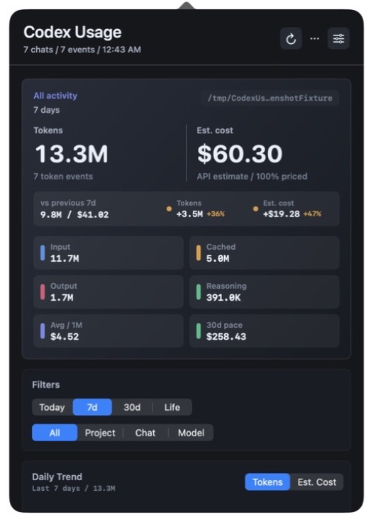
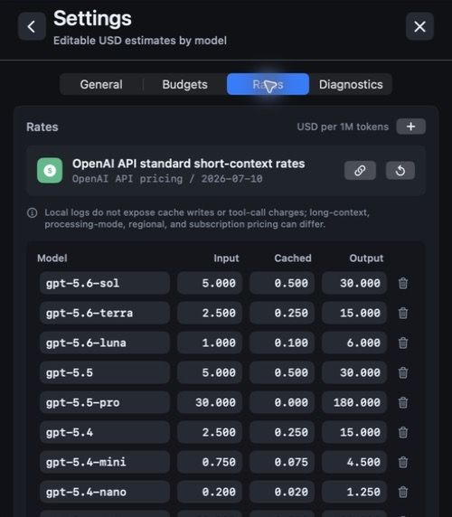

# Codex Usage Monitor

A small native macOS menu-bar app for local Codex usage visibility.

It reads local Codex JSONL logs from `~/.codex/sessions`, `~/.codex/archived_sessions`, and `~/.codex/session_index.jsonl`. It does not read auth files or send data anywhere.

<p align="center">
  
  
</p>
<p align="center"><sub>Synthetic demo data shown. No personal projects, chats, or logs are included.</sub></p>

## Install

- Requires macOS 13 or later on Apple silicon or Intel.
- For public installation, download the notarized DMG from the latest release, open it, and drag **Codex Usage Monitor** to **Applications**.
- Launch the app once, then click its `CX` menu-bar item to open the dashboard. The default data folder is `~/.codex`; choose another Codex log folder in Settings when needed.
- Release builds do not need network access. Local ad-hoc builds are intended for development and are not a substitute for the Developer ID signed and notarized public DMG.

## What It Shows

- Menu-bar total for the selected default window.
- Configurable menu-bar label for tokens, estimated cost, or both.
- Right-click menu-bar snapshot for the active filter, token total, estimated cost, budgets, and scan status.
- Configurable local Codex log folder, with `~/.codex` as the default.
- Includes recent activity from long-running chats even when their session files were created outside the selected history window.
- Wrong-folder warnings with a direct Choose Folder recovery action.
- Tokens and estimated USD cost.
- Previous-period token and estimated-cost comparison for Today, 7-day, and 30-day windows.
- Effective average USD cost per 1M tokens and 30-day cost pace for the active filter.
- Optional token and estimated-cost budgets for the current filter window.
- Menu-bar budget warning markers when configured token or cost budgets are near or over the limit.
- Optional macOS notifications when budgets reach warning or exceeded states.
- Token-level pricing coverage, warnings for incomplete model rates, and one-click placeholder rows in the editable rate table.
- Scan-health notices for first launch, missing logs, malformed log lines, empty filters, and incomplete cost estimates.
- Input, cached input, output, and reasoning token totals when present in local logs.
- Cost mix by non-cached input, cached input, output, and total-only log rows.
- Daily token or estimated-cost trend for the current filter, with explicit inactive calendar days.
- Recent activity list for the latest token events in the current filter.
- 5-hour, weekly, and reset-credit expiry snapshots when Codex has written rate-limit events.
- Filters for today, 7 days, 30 days, lifetime, project, chat, model, and model breakdown.
- Project, chat, and model target filters include all local matches, even when the visible breakdown is capped for scanning.
- Persists the selected time window, scope, target, and editable rates between launches.
- Copy summary and CSV export for the current filter.
- JSON import/export for local app settings, budgets, filters, selected log folder, and editable model rates.
- Copy diagnostics report for support/debugging.
- App menu and status menu actions for about, refresh, export, logs, and quit.
- Dedicated settings view with General, Budgets, Rates, and Diagnostics sections, available from the app menu or with Command-comma.
- Diagnostics and privacy panel with scan health, scanned file count, parse issue count, cache hits, cache size, loaded window, latest event, and local source path.
- Local parsed-log cache for fast repeat startup and refresh scans, with deleted-log pruning and a clear-all-caches control.
- Immutable scan-source snapshots so switching log folders cannot apply stale results from the previous folder.
- Native launch-at-login toggle through macOS Login Items.
- Optional quiet startup that keeps the window hidden until you click the menu-bar item.
- Reopening the already-running app from Finder brings the dashboard back.
- Configurable auto-refresh interval: off, 1 minute, 5 minutes, or 15 minutes, with debounced local log watching when enabled.
- Transactional model-rate editing in USD per 1M tokens, including custom add/remove rows with explicit Apply and Revert controls.
- Built-in OpenAI API standard rate source/date, with a direct pricing link and restore action.
- Live-updating Touch Bar summary, refresh, and time-window controls on Macs that expose Touch Bar.
- App icon, privacy manifest, release zip/DMG targets, checksums, and Developer ID notarization target.

## Build

```bash
make
```

The app bundle is written to:

```text
../../outputs/CodexUsageMonitor.app
```

If `../../outputs` does not exist, the Makefile writes artifacts to the parent folder. You can always override the location with `OUT_DIR=/path/to/output`.

## Run

```bash
make run
```

Or open `outputs/CodexUsageMonitor.app`.

## Demo Data

Generate a privacy-safe Codex log folder for local demos, screenshots, or parser testing:

```bash
make demo-data
```

The fixture is written to `build/demo-codex-home`. Open Settings in the app, choose that folder as the Codex log folder, and select the 7-day window. Use `DEMO_OUT=/path/to/folder make demo-data` to choose another destination. Regeneration is guarded: `--replace` only removes folders previously marked by this generator.

See [Docs/Screenshots/README.md](Docs/Screenshots/README.md) for the public screenshot workflow.

## Verify

```bash
make test
make verify-concurrency
make check
make verify-runtime
make verify-release
make verify-public-release BUNDLE_IDENTIFIER=com.yourdomain.codexusagemonitor
make verify-public-source
make source-archive
python3 Tools/ValidateReleaseVersion.py --repo . --tag v0.4.1
```

`make test` runs synthetic usage tests for cost math, pricing source metadata, budget tracking and alerts, diagnostics reports, unpriced-model handling, filtering, recent activity, persisted preferences, startup, refresh throttling, mid-scan source changes, menu-bar display and snapshot behavior, expired limits, calendar-aligned token/cost trends, summary text, CSV export, parse-cache behavior, parse diagnostics, extreme numeric log containment, Codex JSONL parsing, demo-fixture safety, public support metadata, bundle identifier validation, and Developer ID signing-identity validation. `make verify-concurrency` type-checks the app, test harness, and diagnostic tool with Swift complete concurrency checking and treats every warning as an error. `make check` runs that gate, builds the app, runs the tests, runs a bounded 7-day local usage diagnostic, validates plists, validates the source and bundled privacy manifests, verifies the universal binary slices, and checks the ad-hoc signature. `make verify-runtime` is an interactive macOS smoke test: it launches an isolated instance of the exact built bundle, confirms the panel appears, activates Finder, requires the panel to hide, terminates the isolated instance, and restores the previously focused app. `make verify-release` also rebuilds the zip and DMG, generates the release manifest with privacy, pricing, actual executable architecture metadata, and code-signature metadata, checks both SHA-256 files, verifies the disk image, and verifies the manifest. `make verify-public-release` adds the public gate: the repo must be clean, `BUNDLE_IDENTIFIER` must be a non-placeholder reverse-DNS identifier, the manifest must match the current commit, and `gitDirty` must be false.

The GitHub Actions workflow in `.github/workflows/release-check.yml` runs `make verify-public-release`, checks the bundle identifier override path, and uploads the app, zip, DMG, checksums, and manifest as workflow artifacts. The separate credential-gated `.github/workflows/publish-release.yml` workflow turns a matching `v*` tag into a Developer ID signed, notarized, stapled GitHub release.

The development Git history contains early machine-local metadata and must not be pushed directly. `make verify-public-source` audits the current tracked snapshot, while `make source-archive` creates a clean source ZIP for updating the [MIT-licensed public repository](https://github.com/Heaaaaaaaa/Codex-Usage-Monitor) through a separate clean clone and GitHub no-reply identity. See [PUBLISHING.md](PUBLISHING.md) for the sanitized-history workflow.

## Package

```bash
make release
make dmg
make release-manifest
make verify-artifacts
make verify-public-artifacts
```

The distributable artifacts are written to:

```text
../../outputs/CodexUsageMonitor-0.4.1.zip
../../outputs/CodexUsageMonitor-0.4.1.zip.sha256
../../outputs/CodexUsageMonitor-0.4.1.dmg
../../outputs/CodexUsageMonitor-0.4.1.dmg.sha256
../../outputs/CodexUsageMonitor-0.4.1.manifest.json
```

The default release is ad-hoc signed for local testing. The DMG target creates a drag-to-Applications installer image from the current app bundle.

The build generates the app bundle's `Info.plist` from Makefile release variables, so publish builds can override metadata without editing source files:

```bash
make verify-release BUNDLE_IDENTIFIER=com.yourname.codexusagemonitor
```

Verify downloaded or copied artifacts from the folder containing them:

```bash
shasum -a 256 -c CodexUsageMonitor-0.4.1.zip.sha256
shasum -a 256 -c CodexUsageMonitor-0.4.1.dmg.sha256
```

## Developer ID Distribution

For public distribution outside your own Mac, use a Developer ID Application certificate and a stored `notarytool` keychain profile.

Create the profile once:

```bash
xcrun notarytool store-credentials "CodexUsageMonitorNotary" \
  --apple-id "you@example.com" \
  --team-id "TEAMID" \
  --password "app-specific-password"
```

Build, sign, notarize, staple, and repackage:

```bash
make release-notarized \
  BUNDLE_IDENTIFIER="com.yourname.codexusagemonitor" \
  SIGN_IDENTITY="Developer ID Application: Your Name (TEAMID)" \
  NOTARY_PROFILE="CodexUsageMonitorNotary"
```

`make release-notarized` refreshes the zip checksum after stapling.

For a signed, notarized, stapled DMG:

```bash
make publish-preflight \
  BUNDLE_IDENTIFIER="com.yourdomain.codexusagemonitor" \
  SIGN_IDENTITY="Developer ID Application: Your Name (TEAMID)" \
  NOTARY_PROFILE="CodexUsageMonitorNotary"

make release-dmg-notarized \
  BUNDLE_IDENTIFIER="com.yourdomain.codexusagemonitor" \
  SIGN_IDENTITY="Developer ID Application: Your Name (TEAMID)" \
  NOTARY_PROFILE="CodexUsageMonitorNotary"
```

`make release-dmg-notarized` first requires a clean git worktree, a non-placeholder reverse-DNS bundle identifier, and a `Developer ID Application: ... (TEAMID)` signing identity, runs the notarized zip flow, then builds the DMG from the stapled app, signs the DMG, submits the DMG to notarytool, staples it, refreshes the DMG checksum, and runs `make verify-public-artifacts` with the Developer ID signature policy. Use a stable reverse-DNS `BUNDLE_IDENTIFIER` for public builds so updates keep the same app identity and preferences container.

The app is not sandboxed because it reads local Codex logs from `~/.codex` directly. The release build uses hardened runtime signing with minimal entitlements.

See [PUBLISHING.md](PUBLISHING.md) for the release checklist and final upload gates.

## Privacy

The app reads only local Codex log files from the selected Codex log folder (`~/.codex` by default), stores editable pricing/filter/startup/refresh/source preferences in `UserDefaults`, stores a parsed-log cache under `~/Library/Caches/CodexUsageMonitor`, uses macOS Login Items only when you enable launch at login, and requests macOS notification permission only when budget notifications are enabled. Settings export writes only app preferences and editable rate rows, not token history or log contents. It does not collect analytics, transmit usage data, or read Codex auth files. Release verification requires the privacy manifest to declare `UserDefaults` with required-reason code `CA92.1`.

See [PRIVACY.md](PRIVACY.md) for the publishable privacy policy and deletion details.

## Support and Security

Use the repository bug-report template and follow [Support](SUPPORT.md) for the diagnostic information that helps without exposing local Codex logs. Report suspected vulnerabilities privately using [Security](SECURITY.md); do not put security-sensitive details or raw logs in a public issue.

## Pricing Notes

The built-in defaults use OpenAI API Standard short-context rates from [OpenAI API pricing](https://developers.openai.com/api/docs/pricing), verified on 2026-07-10. The catalog includes GPT-5.6 Sol, Terra, and Luna plus the supported GPT-5.5, GPT-5.4, and GPT-5.3-Codex rows. Rates remain editable, and the Settings view can restore the built-in profile.

Pricing coverage is calculated from the token components actually present in the selected window. A model is flagged only when an observed input, cached-input, output, or total-only component lacks a positive configured rate. Total-only legacy rows are estimated at the configured input rate because their input/output split is unavailable. Local Codex logs do not expose cache-write counts or tool-call charges, and the built-in profile does not apply long-context multipliers, Batch, Flex, Priority, regional uplifts, subscription billing, or other account-specific adjustments. Treat the displayed cost as a transparent API-rate estimate rather than an invoice or ChatGPT subscription charge.
